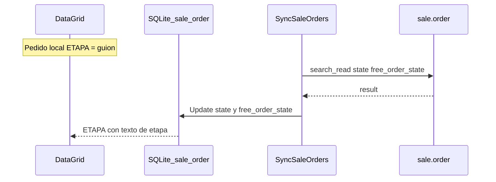

# Informe: columna ETAPA del pedido (`free_order_state`)

Fecha: 2026-08-06  
Alcance: DMOrders — listado de pedidos (home) + sync de estados desde Odoo.

---

## 1. Resumen ejecutivo

| Objetivo | Antes | Después |
|----------|--------|---------|
| Ver etapa web en la tablet | Solo **ESTADO** móvil (ACTIVO / SINCRONIZADO / …) | Backend guarda `free_order_state`; **UI ETAPA comentada** en DataGrid (reactivable) |
| Origen de la etapa | Campo Odoo `free_order_state` existía, pero **no** se pedía ni guardaba | Se pide en `GetByIds`, se guarda en SQLite y se muestra |
| Pedido local no sync | N/A | En BD/etapa vacía → `-` (si UI activa) |
| Envío create a Odoo | Fallaba si se mandaba `free_order_state_view` | Se excluye del payload (igual que `state_view`) |

**Decisión de diseño:** no mezclar etapa web en `state_view`. ESTADO = ciclo móvil/Odoo (`state` + `is_synchronized`). ETAPA = flujo web (`free_order_state`).

---

## 2. Antes / después

### 2.1 Sync de pedidos (`SyncSaleOrders`)

**Antes**

- `HubSaleOrder.fields_array`: `id`, `name`, `company_id`, `state`.
- Solo se actualizaba `state` en SQLite.

**Después**

- `fields_array` incluye `free_order_state`.
- Se actualiza `state` y `free_order_state` (valores `False`/`false` de Odoo → vacío).

### 2.2 Modelo / UI

**Antes**

- Listado: columnas … TOTAL | ESTADO | acciones.
- Sin propiedad local de etapa.

**Después (UI actual)**

- Listado visible: … TOTAL | ESTADO | acciones (sin columna ETAPA en pantalla).
- Código de ETAPA **comentado** en `DataGrid.xaml` para reactivar después.
- Modelo + sync de `free_order_state` siguen activos en segundo plano.

### 2.3 BD local (tablets con BD ya creada)

**Antes**

- `CreateTableAsync` crea la tabla si no existe; **no** agrega columnas nuevas en tablas existentes.

**Después**

- `SaleOrderDb.OnAfterInit`: si falta la columna → `ALTER TABLE sale_order ADD COLUMN free_order_state TEXT`.
- BD nueva: la columna nace con `CreateTable` del modelo actualizado.

### 2.4 Error al enviar pedido

**Error**

```text
ValueError: Invalid field 'free_order_state_view' on model 'sale.order'
```

**Causa**

- `IncludeJsonIgnoreResolver` serializa propiedades calculadas de UI.
- Odoo no tiene `free_order_state_view`.

**Después**

- Se elimina `free_order_state_view` en `HubSaleOrder.Create` y en `PreparePayLoad` (junto a `state_view`).

---

## 3. Mapeo de etapa (UI)

| Código Odoo | Texto en tablet |
|-------------|-----------------|
| *(null / vacío / False)* | `-` |
| INGRESADO | INGRESADO |
| REVCREDITO | REVISIÓN CREDITO |
| ESPERAAPROBACION | EN ESPERA APROBACIÓN |
| REVCOMPLETA | REVISIÓN COMPLETA |
| ESPERAWMS | EN PROCESO WMS |
| RESTRICCION | RESTRICCIÓN |
| FINALIZADO | FACTURADO |
| RECHAZADO | RECHAZADO |
| APROBADO | APROBADO |
| RESPALDO | RESPALDO PEDIDO |

`state_view` (ESTADO) se mantiene sin cambios: ACTIVO, SINCRONIZADO, FACTURADO, TERMINADO, CANCELADO según `state` + `is_synchronized`.

---

## 4. Archivos modificados

Rutas desde `HubManager\`.

| Archivo | Cambio |
|---------|--------|
| `DMSA.Models.Odoo\Native\sale_order.cs` | `free_order_state`, `free_order_state_view` |
| `ApiManagerOdoo\Sale\HubSaleOrder.cs` | Campo en `fields_array`; quitar `free_order_state_view` del create |
| `DMSA.Sync.Core\Update\ServerPuller.SaleOrders.cs` | Persistir `free_order_state` en sync |
| `DMSA.Sync.Core\Database\Sqlite\SaleOrderDb.cs` | Migración `ALTER` si falta la columna |
| `DMSA.Sync.Core\Update\Pusher\SaleOrders.cs` | Quitar `free_order_state_view` / `state_view` del payload externo |
| `DMOrders\Pages\Fragments\Orders\DataGrid.xaml` | Columna **ETAPA** comentada (reactivable); ver §7 |

---

## 5. Flujo



---

## 6. Criterio de aceptación

- [ ] Pedido no sincronizado: ESTADO = ACTIVO (o según lógica); ETAPA en UI solo si se descomenta.
- [ ] Tras enviar + sync de pedidos: `free_order_state` queda en SQLite (aunque la columna UI esté comentada).
- [ ] ESTADO sigue mostrando ACTIVO / SINCRONIZADO sin mezclarse con la etapa.
- [ ] Tablet con BD antigua: al abrir pedidos no falla; columna se agrega con ALTER.
- [ ] Enviar pedido a Odoo no lanza `Invalid field 'free_order_state_view'`.

---

## 7. UI comentada en DataGrid (2026-08-06)

La columna **ETAPA** en [`DataGrid.xaml`](../Pages/Fragments/Orders/DataGrid.xaml) quedó **comentada** (no se muestra en el listado), pero el backend sigue activo.

| Pieza | Estado |
|-------|--------|
| Header `ETAPA` + Label `free_order_state_view` | Comentados en XAML |
| `ColumnDefinitions` | Vuelta a 7 columnas (`70,350,*,*,*,*,100`) |
| Acciones (editar/borrar) | `Grid.Column="6"` |
| `sale_order.free_order_state` / `free_order_state_view` | Siguen en el modelo |
| Sync `GetByIds` + `SyncSaleOrders` | Siguen pidiendo/guardando etapa |
| `ALTER` en `SaleOrderDb` | Sigue |

### Cómo reactivar la columna en UI

1. En header y fila: `ColumnDefinitions="70,350,*,*,*,*,*,100"` (8 columnas).
2. Descomentar el `Label` del header **ETAPA** (columna 6).
3. Descomentar el `Label` con `Text="{Binding free_order_state_view}"` (columna 6).
4. Mover los `HorizontalStackLayout` de acciones a `Grid.Column="7"`.
5. El header `-` de acciones pasa a columna 7.

Instrucciones también están en comentarios dentro del propio `DataGrid.xaml`.

---

## 8. Qué no cambia

- Campos `state_view` sale/done/cancel (siguen en ESTADO; no los reemplaza la etapa).
- Procesamiento de promos en `mnsa_mobile` / `mnsa_base`.
- Detalle de líneas del pedido (el sync de pedidos sigue siendo cabecera: id, name, company_id, state, free_order_state).
